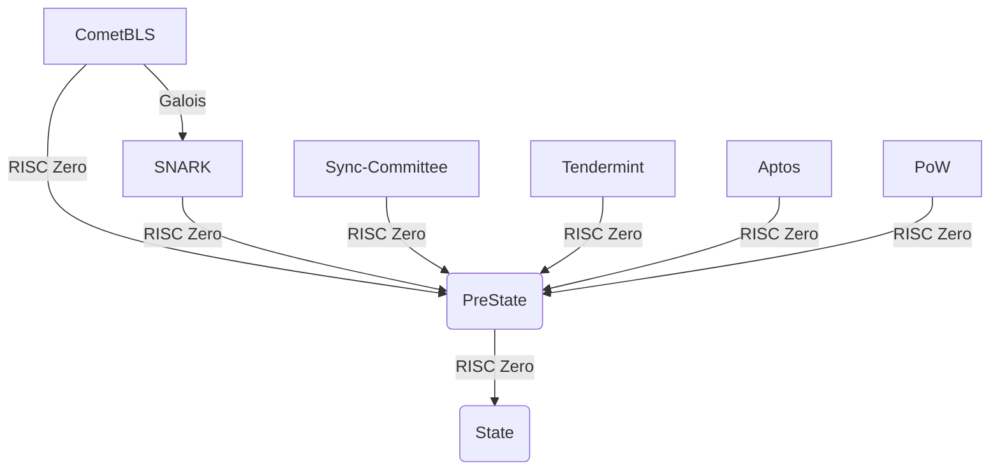
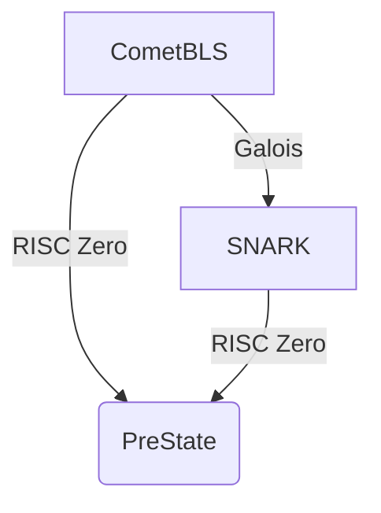
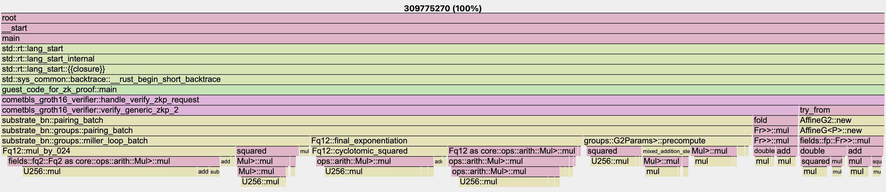

This repository contains benchmarks and exploratory code for Union Core V2 on RISC Zero. The objective is to identify the best architecture to efficiently aggregate multiple types of proofs, and potentially supercede Galois.

## Architecture

Union Core V2 aggregates lightclient proofs for an arbitrary amount of chains in parallel, to form the PreState. Once generated, the PreState is transformed into the final State by applying different smart contracts (transformers) over the order flow, performing such operations as netting, CoW, or prefilling.



For the initial exploration, we are interested in evaluation of this branch:



In particular, if it is more efficient to aggregate a proof generated by Galois, or to prove the CometBLS lightclient using RISC Zero. In both cases, RISC Zero is used to construct the final proof.

## Methodology

We are interested in the total latency from the first proof until PreState, measured in milliseconds. That means for the CometBLS-RISC Zero approach, we benchmark `STARK -> SNARK`, while for CometBLS-Galois, we benchmark `SNARK -> STARK -> SNARK`.

## Developing

### Prerequisites

Ensure you have the following installed on your system:
- [Rust](https://www.rust-lang.org/tools/install)
- [RiscZero toolchain](https://risczero.com/install)

### Setup

#### Step 1: Install Rust
```bash
curl --proto '=https' --tlsv1.2 -sSf https://sh.rustup.rs | sh
export PATH=$PATH:$HOME/.cargo/bin
rustup toolchain install nightly
rustup default nightly
```

#### Step 2: Install RiscZero
```bash
curl -L https://risczero.com/install | bash
export PATH=$PATH:$HOME/.risc0/bin
rzup install
```

#### Running Test Cases

The test run various test scenarios. The statistics of running the test is written to `./host/out.csv`.

#### Running with fake proof (for testing the configuration)
```bash
RISC0_DEV_MODE=1 cargo test -p host -- --test-threads=1 --nocapture
```

#### Running locally (generating 'stark' proof)

To run the tests generating the proof on the local machine, use the following command:

```bash
RISC0_DEV_MODE=0 cargo test -p host -- --test-threads=1 --nocapture
```
`test-threads=1`: because we run one test at the time, so we can measure performance of each test.

#### Running with Bonsai API (generating 'stark' proof)

To run the tests while integrating with the Bonsai API, use the following command:

```bash
RISC0_DEV_MODE=0 SNARK_WRAPPING=0 BONSAI_API_URL=https://api.bonsai.xyz BONSAI_API_KEY=<your-api-key> cargo test -p host -- --test-threads=1 --nocapture
```
`test-threads=1`: because we run one test at the time, so don't run into api usage limitations.

Replace `<your-api-key>` with your actual Bonsai API key.

#### Running with Bonsai API (generating 'stark' proof and wrap in 'snark' proof)

To run the tests while integrating with the Bonsai API, use the following command:

```bash
RISC0_DEV_MODE=0 SNARK_WRAPPING=1 BONSAI_API_URL=https://api.bonsai.xyz BONSAI_API_KEY=<your-api-key> cargo test -p host -- --test-threads=1 --nocapture
```
`test-threads=1`: because we run one test at the time, so don't run into api usage limitations.

Replace `<your-api-key>` with your actual Bonsai API key.

### Test Results

#### 2024-10-02: Generating Stark Proof - Local
- System: MacBook Pro (16-inch, Nov 2023) - Apple M3 Max - 128GB - macOS Sonoma 14.6.1
- r0.1.79.0-2-risc0-rust-aarch64-apple-darwin     (rustc 1.79.0-dev (22b036206 2024-08-21))

| test                       | duration_millis | segments | total_cycles | user_cycles |
|----------------------------|----------------:|---------:|-------------:|------------:|
| test_invalid_block_969002  |         2736057 |      325 |    340787200 |   309775278 |
| test_invalid_block_969006  |         2746663 |      325 |    340262912 |   309658054 |
| test_invalid_proof         |         2738722 |      324 |    339738624 |   309195187 |
| test_invalid_verifying_key |         1355424 |      161 |    168034304 |   153529076 |
| test_tampered_block_969001 |         2741217 |      325 |    340262912 |   309600358 |
| test_valid_block_969001    |         2767530 |      325 |    340787200 |   309767266 |
| test_valid_block_969002    |         2730153 |      326 |    341049344 |   310300091 |
| test_valid_proof           |         2718512 |      325 |    340000768 |   309422908 |

- System: Pop!_OS 22.04 LTS - Intel(R) Core(TM) i9-14900K - 96GB RAM - NVIDIA RTX 4080 - Samsung SSD 990 PRO 2TB rustc 1.79.0 (129f3b996 2024-06-10)

| test                       | duration_millis | segments | total_cycles | user_cycles |
|----------------------------|----------------:|---------:|-------------:|------------:|
| test_invalid_block_969002   |         8306195 |      325 |    340787200 |   309775278 |
| test_invalid_block_969006   |         8240079 |      325 |    340262912 |   309658054 |
| test_invalid_proof          |         8232222 |      324 |    339738624 |   309195187 |
| test_invalid_verifying_key  |         4064690 |      161 |    168034304 |   153529076 |
| test_tampered_block_969001  |         8227910 |      325 |    340262912 |   309600358 |
| test_valid_block_969001     |         8237661 |      325 |    340787200 |   309767266 |
| test_valid_block_969002     |         8239499 |      326 |    341049344 |   310300091 |
| test_valid_proof            |         8213685 |      325 |    340000768 |   309422908 |

#### 2024-10-02: Generating Stark Proof - Bonsai
- System: MacBook Pro (16-inch, Nov 2023) - Apple M3 Max - 128GB - macOS Sonoma 14.6.1
- r0.1.79.0-2-risc0-rust-aarch64-apple-darwin     (rustc 1.79.0-dev (22b036206 2024-08-21))

| test                       | duration_millis | segments | total_cycles | user_cycles |
|----------------------------|----------------:|---------:|-------------:|------------:|
| test_invalid_block_969002  |          145966 |      156 |    325189632 |   309775278 |
| test_invalid_block_969006  |           89137 |      155 |    325058560 |   309658054 |
| test_invalid_proof         |           67711 |      155 |    325058560 |   309195187 |
| test_invalid_verifying_key |           41658 |       77 |    161480704 |   153529076 |
| test_tampered_block_969001 |           57614 |      155 |    325058560 |   309600358 |
| test_valid_block_969001    |           57429 |      156 |    325124096 |   309767266 |
| test_valid_block_969002    |           56864 |      156 |    326107136 |   310300091 |
| test_valid_proof           |           56622 |      155 |    325058560 |   309422908 |

- System: Pop!_OS 22.04 LTS - Intel(R) Core(TM) i9-14900K - 96GB RAM - NVIDIA RTX 4080 - Samsung SSD 990 PRO 2TB rustc 1.79.0 (129f3b996 2024-06-10)

| test                       | duration_millis | segments | total_cycles | user_cycles |
|----------------------------|----------------:|---------:|-------------:|------------:|
| test_invalid_block_969002   |          148527 |      156 |    325189632 |   309775278 |
| test_invalid_block_969006   |           98429 |      155 |    325058560 |   309658054 |
| test_invalid_proof          |           65718 |      155 |    325058560 |   309195187 |
| test_invalid_verifying_key  |           42160 |       77 |    161480704 |   153529076 |
| test_tampered_block_969001  |           59479 |      155 |    325058560 |   309600358 |
| test_valid_block_969001     |           59723 |      156 |    325124096 |   309767266 |
| test_valid_block_969002     |           54372 |      156 |    326107136 |   310300091 |
| test_valid_proof            |           58768 |      155 |    325058560 |   309422908 |

#### 2024-10-03: Generating Stark Proof and wrap in Snark Proof - Bonsai
- System: MacBook Pro (16-inch, Nov 2023) - Apple M3 Max - 128GB - macOS Sonoma 14.6.1
- r0.1.79.0-2-risc0-rust-aarch64-apple-darwin     (rustc 1.79.0-dev (22b036206 2024-08-21))

| test                       | duration_millis | segments | total_cycles | user_cycles |
|----------------------------|----------------:|---------:|-------------:|------------:|
| test_invalid_block_969002  |          162386 |      156 |    325189632 |   309775278 |
| test_invalid_block_969006  |          134967 |      155 |    325058560 |   309658054 |
| test_invalid_proof         |           91479 |      155 |    325058560 |   309195187 |
| test_invalid_verifying_key |           60356 |       77 |    161480704 |   153529076 |
| test_tampered_block_969001 |           75227 |      155 |    325058560 |   309600358 |
| test_valid_block_969001    |           74634 |      156 |    325124096 |   309767266 |
| test_valid_block_969002    |           75680 |      156 |    326107136 |   310300091 |
| test_valid_proof           |           75964 |      155 |    325058560 |   309422908 |

- System: Pop!_OS 22.04 LTS - Intel(R) Core(TM) i9-14900K - 96GB RAM - NVIDIA RTX 4080 - Samsung SSD 990 PRO 2TB rustc 1.79.0 (129f3b996 2024-06-10)

| test                       | duration_millis | segments | total_cycles | user_cycles |
|----------------------------|----------------:|---------:|-------------:|------------:|
| test_invalid_block_969002   |          160630 |      156 |    325189632 |   309775278 |
| test_invalid_block_969006   |          115332 |      155 |    325058560 |   309658054 |
| test_invalid_proof          |           90974 |      155 |    325058560 |   309195187 |
| test_invalid_verifying_key  |           62029 |       77 |    161480704 |   153529076 |
| test_tampered_block_969001  |           73798 |      155 |    325058560 |   309600358 |
| test_valid_block_969001     |           69144 |      156 |    325124096 |   309767266 |
| test_valid_block_969002     |           73998 |      156 |    326107136 |   310300091 |
| test_valid_proof            |           69619 |      155 |    325058560 |   309422908 |

### Profiler
Below the profiler report of the `test_invalid_block_969002` test (all tests have similar results). The raw data can be downloaded [here](assets/test_invalid_block_969002.pb).

#### Flamegraph


#### Functions sorted by cycle-count
|      Flat |   Flat% |   Sum% |       Cum |    Cum% | Name                                                                                                     |
|----------:|--------:|-------:|----------:|--------:|----------------------------------------------------------------------------------------------------------|
| 229411014 |  74.06% | 74.06% | 229411014 |  74.06% | substrate_bn::arith::U256::mul                                                                           |
|  28534717 |   9.21% | 83.27% |  28534717 |   9.21% | substrate_bn::arith::U256::add                                                                           |
|  21340597 |   6.89% | 90.16% |  21340597 |   6.89% | substrate_bn::arith::U256::sub                                                                           |
|  15370194 |   4.96% | 95.12% | 219017880 |  70.70% | <substrate_bn::fields::fq2::Fq2 as core::ops::arith::Mul>::mul                                           |
|   2474955 |   0.80% | 95.92% |  36403552 |  11.75% | <substrate_bn::fields::fq2::Fq2 as substrate_bn::fields::FieldElement>::squared                          |
|   2079648 |   0.67% | 96.59% |  82131021 |  26.51% | substrate_bn::fields::fq12::Fq12::mul_by_024                                                             |
|   1983658 |   0.64% | 97.23% |   1983658 |   0.64% | memcpy                                                                                                   |
|   1751274 |   0.57% | 97.80% |  47937611 |  15.47% | substrate_bn::fields::fq12::Fq12::cyclotomic_squared                                                     |
|   1680360 |   0.54% | 98.34% |  61888724 |  19.98% | <substrate_bn::fields::fq6::Fq6 as core::ops::arith::Mul>::mul                                           |
|   1252530 |   0.40% | 98.74% |  59268424 |  19.13% | substrate_bn::groups::AffineG<substrate_bn::groups::G2Params>::precompute                                |
|   1036531 |   0.33% | 99.08% |  24718885 |   7.98% | <substrate_bn::groups::G<P> as substrate_bn::groups::GroupElement>::double                               |
|    587857 |   0.19% | 99.27% |  20852524 |   6.73% | <substrate_bn::groups::G<P> as core::ops::arith::Add>::add                                               |
|    263826 |   0.09% | 99.35% |  95611719 |  30.86% | substrate_bn::fields::fq12::Fq12::final_exponentiation                                                   |
|    198168 |   0.06% | 99.42% |  17058508 |   5.51% | substrate_bn::groups::G<substrate_bn::groups::G2Params>::mixed_addition_step_for_flipped_miller_loop     |
|    190826 |   0.06% | 99.48% | 108353106 |  34.98% | substrate_bn::groups::miller_loop_batch                                                                  |
|    154836 |   0.05% | 99.53% |  45748961 |  14.77% | <substrate_bn::groups::G<P> as core::ops::arith::Mul<substrate_bn::fields::fp::Fr>>::mul                 |
|     23232 |   0.01% | 99.53% |  45652818 |  14.74% | <substrate_bn::fields::fq12::Fq12 as core::ops::arith::Mul>::mul                                         |
|     22144 |   0.01% | 99.54% |  22164784 |   7.16% | <substrate_bn::fields::fq12::Fq12 as substrate_bn::fields::FieldElement>::squared                        |
|      2266 |   0.00% | 99.54% | 279673190 |  90.28% | cometbls_groth16_verifier::verify_generic_zkp_2                                                          |
|      1611 |   0.00% | 99.54% |  30020380 |   9.69% | substrate_bn::groups::AffineG<P>::new                                                                    |
|       712 |   0.00% | 99.54% | 263524807 |  85.07% | substrate_bn::groups::pairing_batch                                                                      |
|       673 |   0.00% | 99.54% |  30006649 |   9.69% | <cometbls_groth16_verifier::G2Affine<byteorder::BigEndian> as core::convert::TryFrom<[u8; _]>>::try_from |
|       286 |   0.00% | 99.54% | 263527093 |  85.07% | substrate_bn::pairing_batch                                                                              |
|       277 |   0.00% | 99.54% | 309731113 |  99.99% | cometbls_groth16_verifier::handle_verify_zkp_request                                                     |
|       276 |   0.00% | 99.54% |  15950853 |   5.15% | <core::iter::adapters::zip::Zip<A,B> as core::iter::adapters::zip::ZipImpl<A,B>>::fold                   |
|        69 |   0.00% | 99.54% | 309772928 | 100.00% | guest_code_for_zk_proof::main                                                                            |
|        40 |   0.00% | 99.54% |  29996483 |   9.68% | substrate_bn::AffineG2::new                                                                              |
|        38 |   0.00% | 99.54% | 309773178 | 100.00% | std::rt::lang_start_internal                                                                             |
|        14 |   0.00% | 99.54% | 309773192 | 100.00% | std::rt::lang_start                                                                                      |
|        14 |   0.00% | 99.54% |  15885018 |   5.13% | <substrate_bn::G1 as core::ops::arith::Mul<substrate_bn::Fr>>::mul                                       |
|        10 |   0.00% | 99.54% | 309775270 | 100.00% | __start                                                                                                  |
|         9 |   0.00% | 99.54% | 309772943 | 100.00% | std::rt::lang_start::{{closure}}                                                                         |
|         9 |   0.00% | 99.54% | 309773201 | 100.00% | main                                                                                                     |
|         6 |   0.00% | 99.54% | 309772934 | 100.00% | std::sys_common::backtrace::__rust_begin_short_backtrace                                                 |

### Conclusion

Risc Zero offers a straightforward API for creating Zero-Knowledge (ZK) circuits. However, it currently falls short of meeting our performance requirements. Generating a STARK proof and wrapping it in a SNARK proof takes between 1 to 2.5 minutes, whereas our current solution generates the SNARK proof in just 8 seconds.

We assume that introducing elliptic curve precompiles for BN254 (namely add/mul/pairing) would drastically lower proving time. We use the [substrate-bn](https://github.com/paritytech/bn) library. This is supported by the profiler report above.

Additional challenges include:

- The toolchain is locked to a specific Rust version, which may conflict with other components of our stack.
- The toolchain requires manual installation, which is incompatible with our current setup using Nix Flakes for development environment management.
