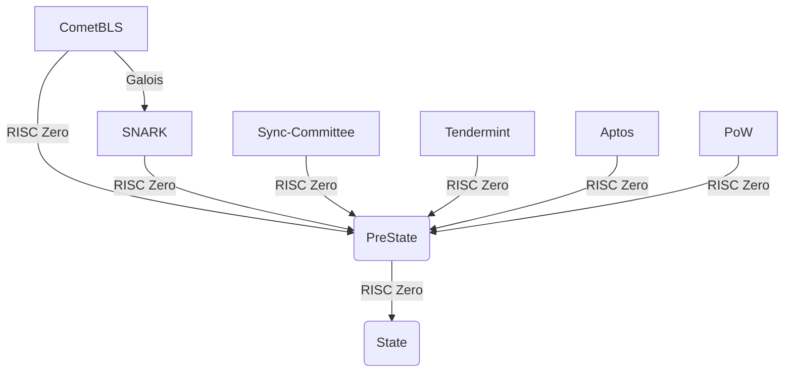
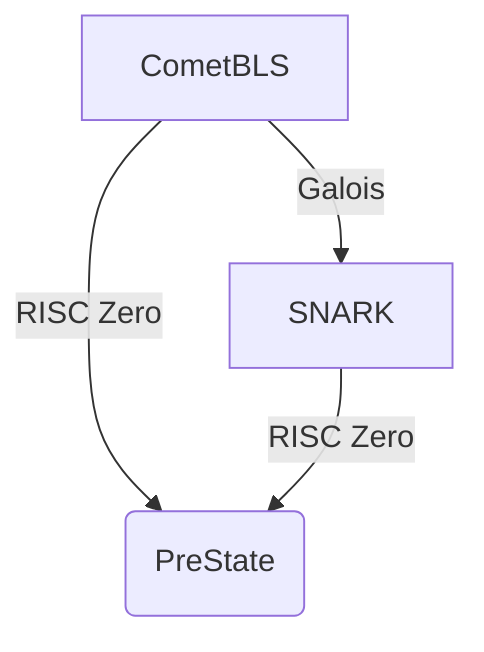

This repository contains benchmarks and exploratory code for Union Core V2 on RISC Zero. The objective is to identify the best architecture to efficiently aggregate multiple types of proofs, and potentially supercede Galois.

## Architecture

Union Core V2 aggregates lightclient proofs for an arbitrary amount of chains in parallel, to form the PreState. Once generated, the PreState is transformed into the final State by applying different smart contracts (transformers) over the order flow, performing such operations as netting, CoW, or prefilling.



For the initial exploration, we are interested in evaluation of this branch:



In particular, if it is more efficient to aggregate a proof generated by Galois, or to prove the CometBLS lightclient using RISC Zero. In both cases, RISC Zero is used to construct the final proof.

## Methodology

We are interested in the total latency from the first proof until PreState, measured in milliseconds. That means for the CometBLS-RISC Zero approach, we benchmark `STARK -> SNARK`, while for CometBLS-Galois, we benchmark `SNARK -> STARK -> SNARK`.

## Developing

```bash
curl --proto '=https' --tlsv1.2 -sSf https://sh.rustup.rs | sh
export PATH=$PATH:$HOME/.cargo/bin
curl -L https://risczero.com/install | bash
export PATH=$PATH:$HOME/.risc0/bin
rzup install
cargo risczero new risczero-poc --guest-name guest_code_for_zk_proof
```
