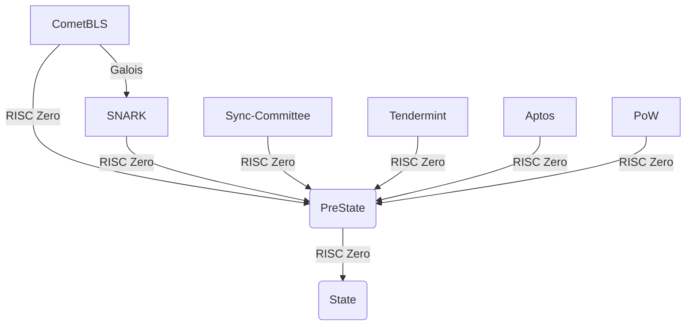
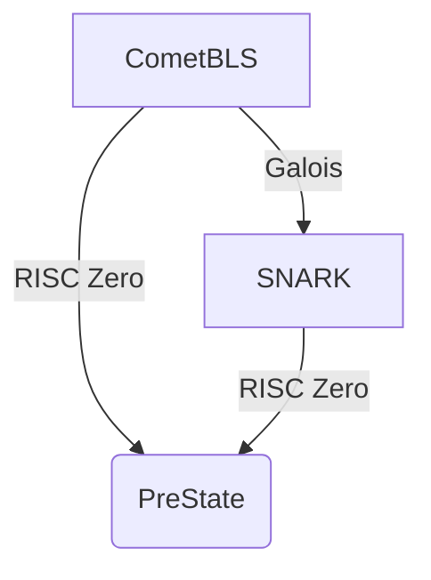

This repository contains benchmarks and exploratory code for Union Core V2 on RISC Zero. The objective is to identify the best architecture to efficiently aggregate multiple types of proofs, and potentially supercede Galois.

## Architecture

Union Core V2 aggregates lightclient proofs for an arbitrary amount of chains in parallel, to form the PreState. Once generated, the PreState is transformed into the final State by applying different smart contracts (transformers) over the order flow, performing such operations as netting, CoW, or prefilling.



For the initial exploration, we are interested in evaluation of this branch:



In particular, if it is more efficient to aggregate a proof generated by Galois, or to prove the CometBLS lightclient using RISC Zero. In both cases, RISC Zero is used to construct the final proof.

## Methodology

We are interested in the total latency from the first proof until PreState, measured in milliseconds. That means for the CometBLS-RISC Zero approach, we benchmark `STARK -> SNARK`, while for CometBLS-Galois, we benchmark `SNARK -> STARK -> SNARK`.

## Developing

### Prerequisites

Ensure you have the following installed on your system:
- [Rust](https://www.rust-lang.org/tools/install)
- [RiscZero toolchain](https://risczero.com/install)

### Setup

#### Step 1: Install Rust
```bash
curl --proto '=https' --tlsv1.2 -sSf https://sh.rustup.rs | sh
export PATH=$PATH:$HOME/.cargo/bin
rustup toolchain install nightly
rustup default nightly
```

#### Step 2: Install RiscZero
```bash
curl -L https://risczero.com/install | bash
export PATH=$PATH:$HOME/.risc0/bin
rzup install
```

### Running the Project

#### Running in Development Mode

To run the project in development mode, execute the following command:

```bash
RISC0_DEV_MODE=0 cargo run
```

This will run the code in non-production mode, which is useful for faster iteration during development.

#### Running in Production Mode

To run the project in production mode, switch the `RISC0_DEV_MODE` environment variable to `1`:

```bash
RISC0_DEV_MODE=1 cargo run
```

This mode enforces the security guarantees of the zero-knowledge proofs.

#### Running Test Cases

To execute the test cases for the host code:

```bash
RISC0_DEV_MODE=0 cargo test -p host
```

#### Running with Bonsai API

To run the project while integrating with the Bonsai API, use the following command:

```bash
RISC0_DEV_MODE=0 BONSAI_API_URL=https://api.bonsai.xyz BONSAI_API_KEY=<your-api-key> cargo test -p host
```

Replace `<your-api-key>` with your actual Bonsai API key.

### Test Results

#### 2024-10-02: Generating Stark Proof - Local
- System: MacBook Pro (16-inch, Nov 2023) - Apple M3 Max - 128GB - macOS Sonoma 14.6.1
- r0.1.79.0-2-risc0-rust-aarch64-apple-darwin     (rustc 1.79.0-dev (22b036206 2024-08-21))

| test                       | duration_millis | segments | total_cycles | user_cycles |
|----------------------------|----------------:|---------:|-------------:|------------:|
| test_invalid_block_969002  |         2736057 |      325 |    340787200 |   309775278 |
| test_invalid_block_969006  |         2746663 |      325 |    340262912 |   309658054 |
| test_invalid_proof         |         2738722 |      324 |    339738624 |   309195187 |
| test_invalid_verifying_key |         1355424 |      161 |    168034304 |   153529076 |
| test_tampered_block_969001 |         2741217 |      325 |    340262912 |   309600358 |
| test_valid_block_969001    |         2767530 |      325 |    340787200 |   309767266 |
| test_valid_block_969002    |         2730153 |      326 |    341049344 |   310300091 |
| test_valid_proof           |         2718512 |      325 |    340000768 |   309422908 |

#### 2024-10-02: Generating Stark Proof - Bonsai
- System: MacBook Pro (16-inch, Nov 2023) - Apple M3 Max - 128GB - macOS Sonoma 14.6.1
- r0.1.79.0-2-risc0-rust-aarch64-apple-darwin     (rustc 1.79.0-dev (22b036206 2024-08-21))

| test                       | duration_millis | segments | total_cycles | user_cycles |
|----------------------------|----------------:|---------:|-------------:|------------:|
| test_invalid_block_969002  |          145966 |      156 |    325189632 |   309775278 |
| test_invalid_block_969006  |           89137 |      155 |    325058560 |   309658054 |
| test_invalid_proof         |           67711 |      155 |    325058560 |   309195187 |
| test_invalid_verifying_key |           41658 |       77 |    161480704 |   153529076 |
| test_tampered_block_969001 |           57614 |      155 |    325058560 |   309600358 |
| test_valid_block_969001    |           57429 |      156 |    325124096 |   309767266 |
| test_valid_block_969002    |           56864 |      156 |    326107136 |   310300091 |
| test_valid_proof           |           56622 |      155 |    325058560 |   309422908 |
